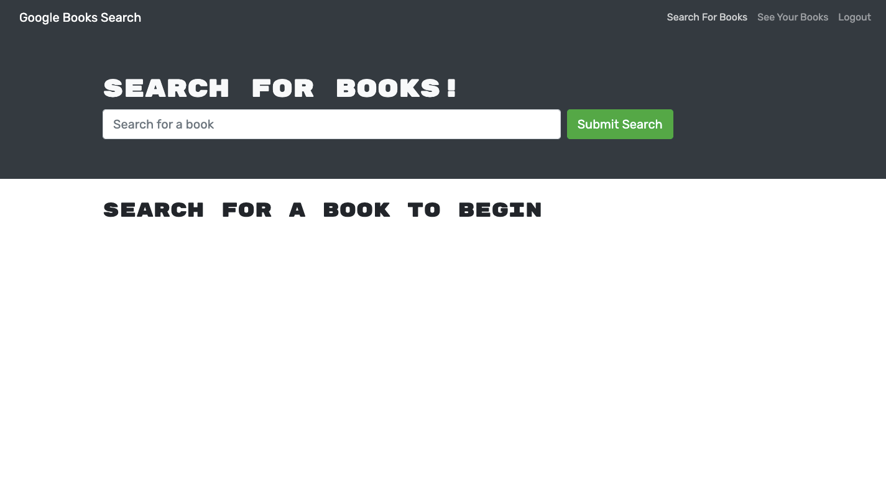

# Google Book Search

## Description

Book Search site that utilizes Google Book Search API, GraphQL queries and mutations to fetch and modify data from Apollo Server, and stores select data in a MongoDB database using MongoDB Atlas.

## Table of Contents
[Screenshots](https://github.com/sranson/google-book-search#Screenshots)

[Deployed Site](https://github.com/sranson/google-book-search#deployed-site)

[Questions](https://github.com/sranson/google-book-search#Questions)

[Contributing](https://github.com/sranson/google-book-search#Contributing)

[License](https://github.com/sranson/google-book-search#License)

## Screenshots
 

 

 

## Deployed Site
[Google Book Search](https://google-booksearch-app.herokuapp.com/)

## Questions

[GitHub Profile](https://github.com/sranson)

Email: salomeranson@gmail.com

## Contributing

Salome A. Ranson

## License

[MIT](https://choosealicense.com/licenses/mit/)